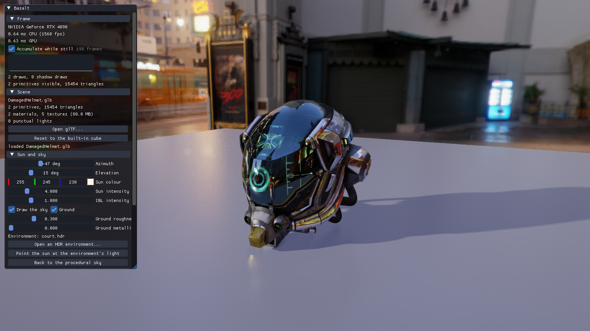

# Basalt

A Vulkan renderer whose shaders are written in **Metal Shading Language**.

There is no GLSL and no HLSL in this repository. Every shader — the PBR forward
pass, the shadow pass, the sky, the reflection resolve, the bloom chain, the
tone mapper, the image-based lighting bake, the ray queries, and even the user
interface — is a `.metal` source compiled to Vulkan SPIR-V at build time by
[`msl2spirv`](tools/metal2vulkan), which the first configure fetches for you.



## What it does

- **glTF 2.0 and GLB** loading: nodes, meshes, metallic-roughness materials,
  textures in the right colour space, punctual lights, and tangents generated
  where a model does not ship them.
- **Physically based shading**: Cook-Torrance GGX with height-correlated Smith
  visibility, multiple-scattering energy compensation, specular and horizon
  occlusion, normal mapping, occlusion, emissive, alpha masking and blending,
  and double-sided materials drawn and shadowed from both sides.
- **Image-based lighting** from a Radiance `.hdr` panorama or from a
  procedural sky: an environment cube and a roughness-prefiltered specular
  chain baked on the GPU, and the diffuse irradiance projected onto nine
  spherical harmonic coefficients on the host, which costs the shaders no
  texture at all. Loading a panorama moves its sun (or moon) out of the image
  into the analytic sun, energy and all, so the rasteriser's shadows and the
  path tracers light with the same sun; a panorama without one lights alone.
- **Reflections** resolved in a compute pass from a small G-buffer the forward
  pass writes beside its colour: the prefiltered environment alone, a
  screen-space march with binary refinement that falls back to it, or a ray
  query through the scene that shades what it hits with the hit's own base
  colour, metallic-roughness, emissive and normal maps, the sun through a
  shadow ray, the punctual lights and the environment. Rough surfaces read a
  blurred mip of the result while the view moves; once it holds still, each
  traced frame samples a different direction of the GGX lobe and the frames
  average into the glossy reflection itself.
- **Shadows** from four cascaded shadow maps, stabilised by fitting a sphere to
  each slice and snapping it to whole texels and filtered through a hardware
  comparison sampler, or from rays traced towards a sun disc of adjustable
  size, which gives contact-hard, distance-soft penumbrae with no bias to tune.
  Every traced ray tests alpha-masked candidates against their texture, so a
  leaf shadows as a leaf and not as its quad.
- **Ambient occlusion** from the material's map, or traced over the hemisphere:
  contact occlusion over a short radius, or sky visibility, the share of the
  environment each point sees, as the path tracers light it.
- **Punctual lights** from the file, each casting a traced shadow, so a light
  behind a wall does not light through it. They are culled into a grid of
  cells every frame, tiles across the screen by slices in depth, so a pixel
  walks only the lights that reach it. A count of test lights scatters point
  lights through the scene, since almost no glTF file carries any.
- **Temporal antialiasing**: every frame is rendered through a different
  sub-pixel offset and blended with the one before it, found again through the
  camera's motion and clamped to its neighbourhood. While the view is still
  the frames are averaged exactly instead, so the stochastic terms (shadow
  cones, occlusion rays, sampled reflections, the march's jitter) converge
  rather than settling at a floor, and any change starts over.
- **Post processing**: bloom through a downsample and tent-filter upsample
  chain, ACES or Reinhard tone mapping, exposure, vignette, grain, sharpening,
  and a choice of no antialiasing, FXAA or temporal.
- **A user interface** built with Dear ImGui, drawn through the engine's own
  Metal shaders rather than the library's bundled SPIR-V.
- **A path tracer** beside the rasteriser, switched with F5 or the interface,
  on the CPU and on the GPU in three ways: inline ray queries, its own BVH in
  compute (SAH or GPU LBVH, binary or quantized BVH4/BVH8), and a full Vulkan
  ray-tracing pipeline. Each runs as a megakernel or as bounce-synchronous
  wavefront stages, and a hybrid mode continues rasterised primaries with
  traced paths. It is unidirectional, with next-event estimation of the
  environment, the sun, punctual lights and emissive meshes, multiple
  importance sampling and Russian roulette. It uses one BSDF for the glTF
  material with transmission, IOR, thin and closed dielectrics and clearcoat.
  Options add thin-lens depth of field, ray-cone texture filtering and ReSTIR DI
  at the primary vertex. Temporal reconstruction and Intel Open Image Denoise
  clean up the display without touching the raw image. The light transport is
  written once, in the subset of MSL that also compiles as C++, so every
  backend runs the same code and they agree to within tested tolerances.
  Captures write linear PFM or OpenEXR with JSON metadata; `basalt --help`
  lists every option.
- **Debug views** for base colour, normals, metallic, roughness, occlusion,
  the shadow term, cascade assignment, emissive, texture coordinates, the
  reflection weight, the resolved reflection and the trace's confidence. They
  bypass tone mapping, so what you see is the number.

The ray-traced options need `VK_KHR_acceleration_structure`, `VK_KHR_ray_query`
and a device that allows 128 sampled images in one stage, which is what the hit
texture table costs. On a device without them the engine loads the rasterised
shader pair and the interface greys those options out; everything else is the
same. Set `BASALT_NO_RAY_TRACING=1` to force that path on a device that could
trace.

## Building

Windows only for now. You need Visual Studio 2022 with the C++ toolset, the
Vulkan SDK, and CMake 3.24 or newer.

```powershell
cmake -S . -B build -G "Visual Studio 17 2022" -A x64
cmake --build build --config RelWithDebInfo --parallel
./build/RelWithDebInfo/basalt.exe
```

That works from an ordinary PowerShell prompt, because the Visual Studio
generator finds the compiler by itself. Ninja builds faster, but it has to be
installed and it expects the compiler already on `PATH`, so run it from the
**x64 Native Tools Command Prompt for VS 2022** rather than a plain shell:

```powershell
cmake -S . -B build -G Ninja -DCMAKE_BUILD_TYPE=RelWithDebInfo
cmake --build build --parallel
./build/basalt.exe
```

The build compiles every `.metal` source in [`shaders/`](shaders) with
`msl2spirv` before it links the engine. A shader that does not compile fails the
build, and a vertex entry whose outputs do not match its fragment entry's inputs
fails it too, because the build passes `--check-fragment-entry` for each pair.

The compiler itself is not in the repository, since it is a 46 MB binary. The
first configure downloads it from this project's releases into
`tools/metal2vulkan/bin/`, checks it against a pinned SHA-256, and never asks
again. To build a copy of your own instead, put it at that path or pass
`-DBASALT_MSL2SPIRV=<path>`; either way the download is skipped.
[`cmake/msl2spirv.cmake`](cmake/msl2spirv.cmake) has the rest, including
`-DBASALT_DOWNLOAD_MSL2SPIRV=OFF` if you would rather it never reached the
network.

The first configure also fetches Intel Embree and Intel Open Image Denoise,
prebuilt and checked against pinned hashes, into `.deps/`. Both are optional:
without them, or with `-DBASALT_WITH_EMBREE=OFF` and `-DBASALT_WITH_OIDN=OFF`,
the path tracer uses its own BVH and does not denoise.

## Running

```
basalt [model.gltf|model.glb] [environment.hdr] [options]
basalt --help
```

A few common runs:

```powershell
# Look around a model; F5 switches to the path tracer.
basalt DamagedHelmet.glb

# A converged GPU path-traced reference: 1024 samples per pixel, raw linear OpenEXR.
basalt DamagedHelmet.glb sky.hdr --renderer gpu --spp 1024 --pfm reference.exr --no-ui

# The same on the CPU, headless, with no Vulkan at all.
basalt-pt-cli DamagedHelmet.glb --environment sky.hdr --spp 1024 --output reference.exr

# ReSTIR DI and depth of field on the GPU's own BVH, wavefront execution.
basalt scene.gltf --renderer gpu-bvh --path-execution wavefront --di-estimator restir --aperture 0.05
```

`basalt --help` lists every option. An output path ending in `.exr` writes
OpenEXR, any other PFM, and each capture writes a JSON metadata file beside it.
`ctest --test-dir build` runs the test suite; a test that needs a capability the
device lacks reports itself skipped.

F1 hides and shows the interface; F5 switches between the rasteriser and the
path tracer; F12 saves a screenshot next to the executable, named by the time,
without leaving.

Orbit with the left mouse button, pan with the middle, zoom with the wheel.
Hold the right mouse button to fly, then use W, A, S, D, Q and E; Escape or
releasing the button gives the cursor back.

Sample models are not committed. Any glTF 2.0 file works; the
[Khronos sample assets](https://github.com/KhronosGroup/glTF-Sample-Assets) are
a good place to start.

## How the Metal side works

The compiler maps Metal's per-stage argument tables onto Vulkan descriptor sets
with one rule: the **vertex or compute stage is set 0 and the fragment stage is
set 1**, and within a set the binding is a class base plus the Metal index —
buffers at 0, samplers at 32, textures at 64. Every compiled shader comes with a
reflection JSON describing exactly that, and the engine builds its descriptor
set layouts, pipeline layouts and vertex input state from it rather than from
constants written twice. `DescriptorWriter` takes resources by the name the
shader gave them, so renaming a texture in a `.metal` file moves its descriptor
with no C++ change.

Two consequences of the profile shaped the design:

- **There are no user push constants**, so per-draw data lives in a storage
  buffer of instance records indexed by `[[instance_id]]`, which Vulkan fills
  from the draw's first instance. A draw is `vkCmdDrawIndexed(..., firstInstance
  = primitive index)` and the vertex entry reads its own transform and material.
- **An entry binds at most eight textures and eight samplers.** The forward
  fragment entry uses all eight (five material maps, the prefiltered cube, the
  shadow array, and the texture table below), which is why the split-sum
  environment BRDF is evaluated analytically instead of sampled from a baked
  lookup table and the diffuse irradiance comes from spherical harmonics in
  the uniforms rather than a cube. An array of textures counts as one binding
  but takes consecutive indices, so it goes last: the forward and resolve
  entries reach every material's base colour, metallic-roughness, emissive and
  normal maps through a single table of 120 slots (white and a flat normal in
  the first two, 118 for the scene's own textures), indexed by the primitive a
  ray hit, which is what lets a shadow ray see through the cut-out of a leaf.
- **An acceleration structure is only traversable from an entry**, not from a
  helper, so every ray loop sits in the entry that owns it: shadow and
  occlusion rays in the forward fragment, reflection rays in the resolve
  kernel. The forward and resolve entries each exist twice, once with the
  acceleration structure parameter and once without, so a device that cannot
  trace never loads a module that asks for it.

[`tools/metal2vulkan/README.md`](tools/metal2vulkan/README.md) documents the
bundled compiler, every option it takes, and how to refresh it from a
Metal2Vulkan checkout.

## Layout

| Path | What is in it |
|---|---|
| `shaders/` | Every shader, in Metal. `common.metal` holds the shared structures and shading maths. |
| `src/core/` | Maths laid out to match MSL, logging, the error type. |
| `src/gpu/` | Vulkan context, swapchain, buffers and images, shader and pipeline creation, descriptors, staging uploads. |
| `src/scene/` | glTF loading, the scene representation, the camera. |
| `src/render/` | The frame: shadow, forward, sky, reflection, bloom and post passes; the acceleration structures; the IBL bake; the ImGui backend. |
| `tools/metal2vulkan/` | The shader compiler, its owned standard library, and the host reflection library that turns each shader's reflection JSON into Vulkan descriptor layouts. |
| `shaders/shared/` | Headers compiled both as MSL and as C++: the buffer structures, the shading maths and the sample stream the rasteriser and the path tracer share. |
| `shaders/pt/` | The path tracer's shared code: BVH traversal, hit reconstruction, the BSDF, light sampling, and the path loop itself (`integrator.inc`). |
| `src/pt/` | The C++ side: the shim that gives MSVC the MSL types, the BVH builders and wide layouts, the environment and albedo tables, the CPU tracer, capture metadata and image files. |
| `tests/` | The CTest manifest's programs and scripts: CPU transport tests, GPU oracles and image gates per backend, lifecycle and CLI rejection tests, and generated test scenes in `tests/data/`. |
| `tools/` | The image comparison script, the benchmark harness and `shader-stats`. |
| `docs/` | The screenshot above. |

## Known limitations

- The rasteriser's ambient light is unoccluded unless traced sky visibility is
  on, and even then it misses light bounced between surfaces, which the path
  tracers include. With the procedural sky it also counts the sky's painted
  disc in its ambient light, about ten per cent too bright.
- The rasteriser draws the base layer of transmissive and clearcoated
  materials only; the path tracers render both layers.

- Windows only. Nothing in the engine is Windows-specific except the window and
  the file dialogs.
- No skinning, morph targets or animation; node transforms are static.
- Transparent surfaces are sorted per primitive, not per triangle, and cast no
  shadows.
- The shadow pass draws alpha-masked casters through a fragment shader that
  returns a colour no attachment receives, because the profile has no
  `fragment void`. The validation layers report that as a warning; opaque
  casters go through a depth-only pipeline with no fragment stage at all.
- `KHR_materials_specular_glossiness` is approximated, not implemented.
- In the rasteriser's traced effects, blended surfaces are left out of the
  acceleration structure, so those rays pass through them; the path tracers
  test blended and masked surfaces in their any-hit.
- A hit shaded by a reflection ray takes the punctual lights unshadowed, and a
  reflection of a reflection is the environment.
- A cell of the light grid holds at most sixty-four lights. Past that the rest
  are dropped by index, so the cell keeps whichever come first rather than the
  nearest, and a light with no falloff reaches every cell. Both only bite where
  that many lights genuinely overlap.
- In the rasteriser, punctual lights are shadowed only on a ray tracing device;
  the rasterised path lights through walls, and the interface says so by
  greying the control. The path tracers shadow them on every device.
- Once a still view has converged, the traced reflection is the average of one
  lobe sample per frame, kept with the cosine as its probability; the frames it
  is not kept read the prefiltered environment instead. Both estimate the same
  integral, so the result is consistent, but it is not a pure path trace.
- The temporal history is reprojected from depth, which is right for a static
  scene but would smear a moving object, so the reprojection will need per
  object motion once anything animates.

## Licence

Basalt is licensed under the Apache License 2.0; see [LICENSE](LICENSE).

The vendored libraries under `third_party/` keep their own licences, and
[NOTICES.md](NOTICES.md) lists them. The `msl2spirv` compiler the build fetches
is a separate project and is not covered by this licence.
